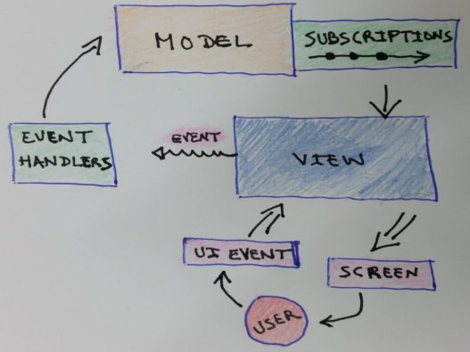
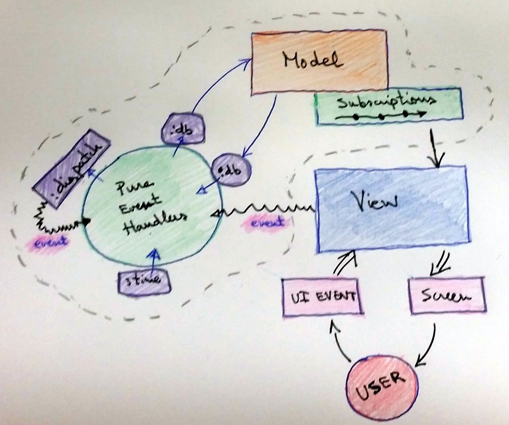
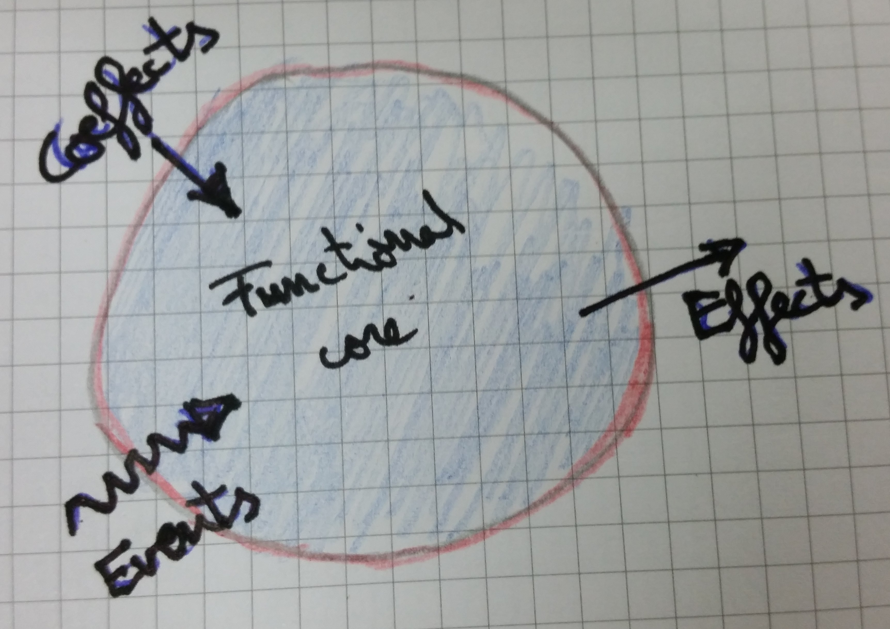

# re-om architecture

## 1. Driven by events and using effects and coeffects to keep event handlers pure.
re-om is a [unidirectional data flow architecture](https://staltz.com/unidirectional-user-interface-architectures.html) in which data isflowing in the form of events, coeffects and effects. re-om is a perpetual cycle that is driven by events.

### 1.1. Similar to redux.
In a simplified view, re-om’s architecture is very similar to [redux](https://redux.js.org/basics/dataflow) (if you forget about subscriptions).

This simplified cycle would work like this:

1. A user interacts with the screen.
2. That interaction produces a UI event.
3. The view translates that UI event into a domain event.
4. That domain event has an event handler registered to it in re-om. re-om finds this event handler and executes it.
5. This execution provokes changes in the model (*app-state* in re-om’s jargon).
6. If there are changes in the *app-state* it may happen that some subscriptions react to them which would force the view components that are subscribed to those subscription to be recomputed.
7. React kicks in and updates the view, rendering the altered UI to the user, who can interact with it, starting the cycle again.

### 1.2. Using effects and Coeffects to have pure event handlers.
If this were all, we wouldn’t be able to have pure event handlers. Side-effects are inevitable. The trick to have pure event handlers is the introduction of effects and coeffects.

**Effects describe your program’s side-effects**, (*what your program does to the world*), whereas
**Coeffects track your program’s side-causes and current context**, (*what your program requires from the world*).

With effects and coeffects the cycle is a bit more nuanced:

The following steps describe this refined cycle. We have highlighted in bold font the new steps in which coeffects and effects are used to ensure that event handlers are pure:

1. A user interacts with the screen.
2. That interaction produces a UI event.
3. The view translates that UI event into a domain event.
4. That domain event has an event handler registered to it in re-om. re-om finds this event handler and executes it.
5. **Anything the event handler needs from the world has been described using a coeffect when the event handler was registered. Right before the event handler gets executed, for each coeffect there is coeffect handler (previously registered in re-om) that injects the actual value the coeffect tracks in a coeffects map which is then passed to the event handler as one of its parameters. This means that any information an event handler needs from the world comes as a parameter in its coeffects map.**
6. **Using this coeffects map and the information in the event payload the event handler computes effects which are descriptions of the side-effects that needs to be done, and returns them in an effects map. An example of an effect is a description of a mutation to the model (*app-state* in re-om’s jargon). There can be many other types of effects, as well as many other types of side-effects.**
7. **For each of the effects returned in the effects, an effect handler (previously registered in re-om) will interpret the effect’s data and realize the side-effect that the effect describes.**
8. If there are changes in the *app-state* it may happen that some subscriptions react to them which would force the view components that are subscribed to those subscription to be recomputed.
9. React kicks in and updates the view, rendering the altered UI to the user, who can interact with it, starting the cycle again.

re-om applies what is known as the [Declarative Effects pattern](https://www.youtube.com/watch?v=6EdXaWfoslc). In this pattern event handlers are pure functions that receive coeffects and return effects. Something else (a language run-time, a framework, etc.) is in charge of injecting the values that the coeffects track and interpreting the effects data to actually perform the side-effects they describe. That something else would be re-om in this case.

### 1.3. re-om as a reduce.
Having this cycle in mind, you can go further and **imagine a re-om app as a reduce**.
At any point in time, if you reduce over all the dispatched events that have happened in the app up until that point in time and the coeffects maps used by each of them, you’ll get the `app-state` at that time.

The combining function for the reduce is the set of registered event handlers. Those event handlers are pure functions which gives us the advantages of:

* **Local reasoning**.
* **Easier testing**.
* **Events replay-ability**.

The constraints of this architecture helps you to **easily isolate your domain logic which is comprised only by pure functions from effectful code**. Those pure functions will form a **functional core** which **communicates with the outside using events, coeffects and effects**.

Around this **functional core** we will find a thin layer of effectful code, the **imperative shell**, comprised by effect handlers and coeffect handlers that use whatever libraries or code they need to interact with the world.

We end up with what [Gary Bernhardt](https://www.destroyallsoftware.com/screencasts) described as a [Functional Core, Imperative Shell architecture]( https://www.destroyallsoftware.com/talks/boundaries).

This architecture can be considered what [Jeff Atwood defined as **a pit of success**](https://blog.codinghorror.com/falling-into-the-pit-of-success/) because it is a design that:

> **“makes it easy to do the right things and annoying (but not impossible) to do the wrong things.”**

The functionality that made this architecture possible is included in [reffectory](https://github.com/GreenPowerMonitor/reffectory) which is independent of the technology used for the view part of the SPA and re-om delegates to it.

### 2. Subscriptions.
Another important characteristic of re-om are subscriptions.

Subscriptions are an efficient de-duplicated signal graph which runs query functions on the `app-state`.

These query functions extract data from the app state and provide it to view functions in the right format.

They help to have a simpler `app-state` because they avoid having to keep derived state in it.

They also extract a lot of logic from views, so views get dumber, to the point that views end up being simple “data in, screen out” functions.

They also provide _performance improvements_ by reducing component renderings and by de-duplicating computations.
